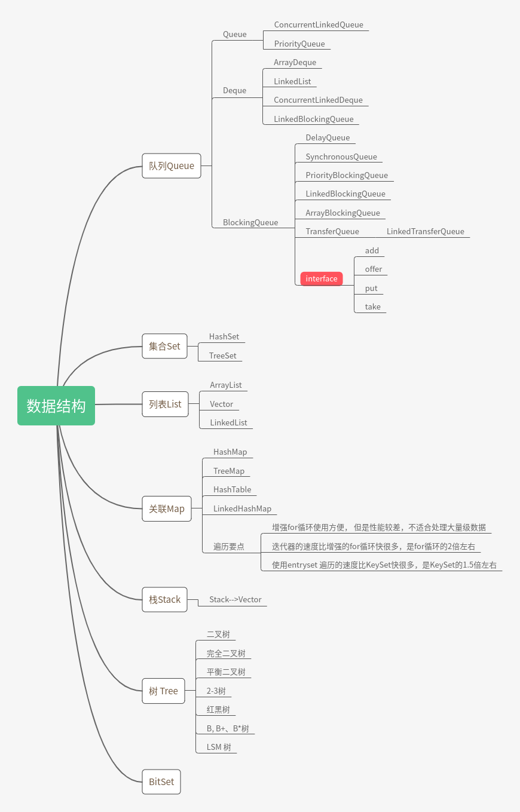
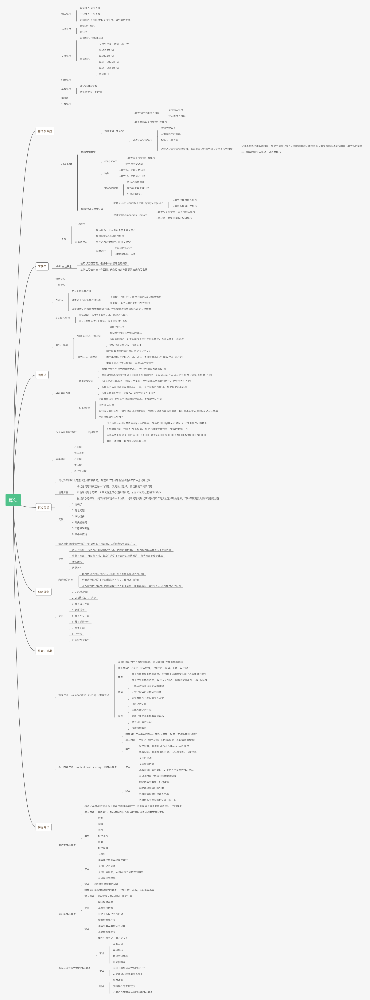
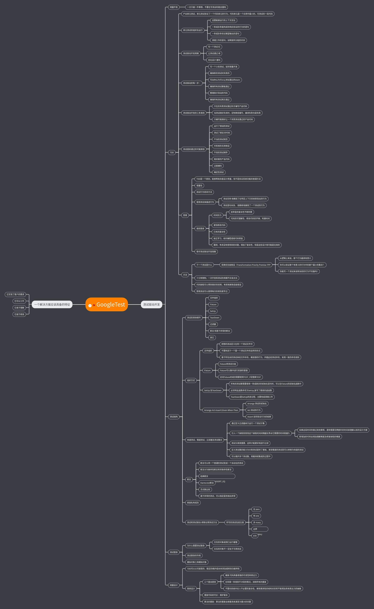
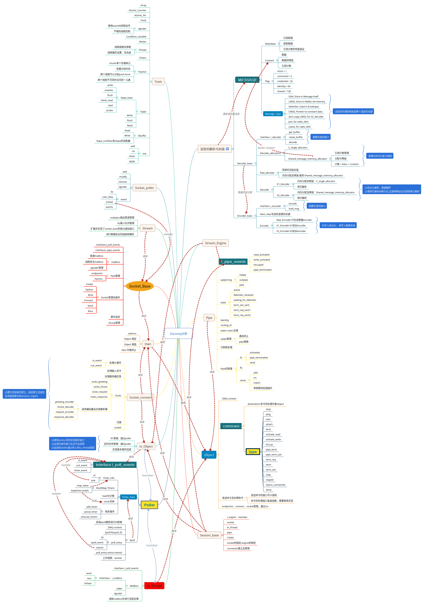
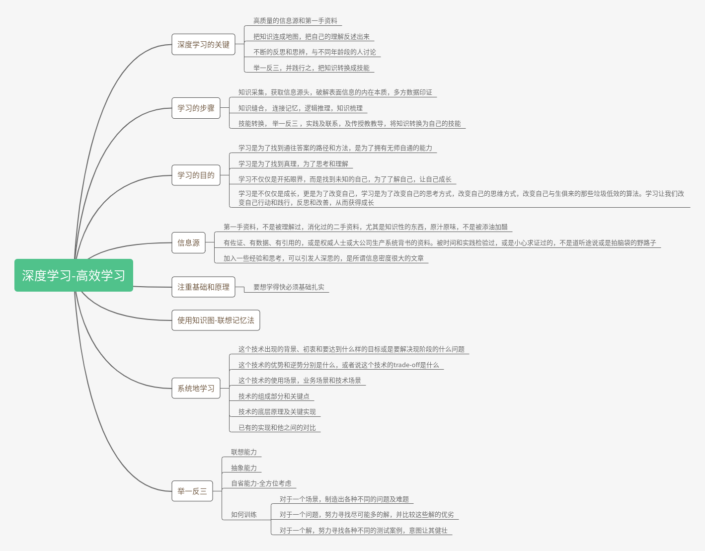

- [收藏总结](#收藏总结)
    - [算法及数据结构](#算法及数据结构)
    - [操作系统](#操作系统)
        - [Linux](#linux)
        - [Android](#android)
    - [设计模式](#设计模式)
    - [编程语言](#编程语言)
    - [嵌入式开发及ＤＮＮ加速](#嵌入式开发及ｄｎｎ加速)
    - [前端及UI设计](#前端及ui设计)
    - [程序打包及安装](#程序打包及安装)
    - [测试](#测试)
    - [深度学习及机器视觉](#深度学习及机器视觉)
        - [机器学习](#机器学习)
        - [CNN](#cnn)
        - [目标检测](#目标检测)
        - [目标跟踪](#目标跟踪)
        - [神经网络量化](#神经网络量化)
        - [开发框架](#开发框架)
        - [数据集](#数据集)
            - [车牌数据集](#车牌数据集)
    - [分布式开发](#分布式开发)
        - [WEB 服务器相关](#web-服务器相关)
        - [数据库](#数据库)
        - [高性能高并发](#高性能高并发)
        - [分布式原理](#分布式原理)
        - [工程化方法](#工程化方法)
    - [大数据处理](#大数据处理)
        - [数据存储](#数据存储)
        - [数据分析](#数据分析)
        - [容器及虚拟化技术](#容器及虚拟化技术)
        - [微服务架构](#微服务架构)
        - [分布式实时计算](#分布式实时计算)
        - [离线批处理](#离线批处理)
        - [消息中间件](#消息中间件)
        - [综合解决方案](#综合解决方案)
    - [金融期货](#金融期货)
    - [电动汽车](#电动汽车)
    - [地图及GPS](#地图及gps)
    - [综合及学习](#综合及学习)
    - 
# 收藏总结

## 算法及数据结构
1. [单轴快排（SinglePivotQuickSort）和双轴快排（DualPivotQuickSort）及其JAVA实现](https://blog.csdn.net/Holmofy/article/details/71168530)
2. 数据结构总结

3. 算法总结

## 操作系统
### Linux
1. [linux进程、线程与cpu的亲和性（affinity)](https://www.cnblogs.com/wenqiang/p/6049978.html)
2. [可执行文件（ELF）格式的理解](https://www.cnblogs.com/xmphoenix/archive/2011/10/23/2221879.html)
3. [Solaris链接程序和库指南](https://docs.oracle.com/cd/E19253-01/819-7050/index.html)
4. [Linux性能评测工具之：gprof](https://blog.csdn.net/stanjiang2010/article/details/5655143)
5. [Ｌinux内核物理内存管理--伙伴系统](https://blog.csdn.net/goodluckwhh/article/details/9989695)
6. [Ｌinux下TCP/IP及内核参数优化调优](https://cppfans.org/1945.html)
7. [Linux 系统内核的调试](https://www.ibm.com/developerworks/cn/linux/l-kdb/)
8. [V4L2文档翻译](https://blog.csdn.net/airk000/article/details/23218903)
9. [大话 Select、Poll、Epoll](https://cloud.tencent.com/developer/article/1005481)
10. [Linux IO模型](https://www.cnblogs.com/LittleHann/p/3897910.html)
11. [使用rsync实现客户端与服务器端的文件同步与传送](https://www.linuxidc.com/Linux/2016-08/134584.htm)
12. [Linux下用文件IO的方式操作GPIO](http://blog.sina.com.cn/s/blog_7880d3350102w2um.html)
13. [Ｌinux新的API signalfd、timerfd、eventfd](https://blog.csdn.net/gdutliuyun827/article/details/8460417)
14. [多线程程序从Windows到Linux上移植需要注意的5个方面](http://ace.acejoy.com/thread-5807-1-1.html)

### Android
1. [Android官方培训课程中文](http://hukai.me/android-training-course-in-chinese/index.html?utm_source=androiddevtools&utm_medium=website)
2. [关于Android Service真正的完全详解](https://blog.csdn.net/javazejian/article/details/52709857)
3. [Android中常见的4种线程池](https://blog.csdn.net/seu_calvin/article/details/52415337)
4. [Android 向项目添加组件](https://developer.android.google.cn/topic/libraries/architecture/adding-components#room)
5. [Android.mk 文件语法详解](https://www.cnblogs.com/wainiwann/p/3837936.html)
6. [Android 文件下载库](https://github.com/wlfcolin/file-downloader/blob/master/README-zh.md)

## 设计模式
1. [被误解的 MVC 和被神化的 MVVM](https://www.infoq.cn/article/rethinking-mvc-mvvm/?utm_source=articles_about_DesignPattern&utm_medium=link&utm_campaign=DesignPattern)

## 编程语言
1. [C#基类库大全](http://www.sufeinet.com/thread-655-1-1.html)
2. [C++调用JAVA方法详解](https://www.iteye.com/blog/public0821-423941)
3. [C#一些支离破碎的泛型反射技巧](https://www.cnblogs.com/ninputer/archive/2006/06/02/415458.html)
4. [Ｌinux C++ 面向对象线程类封装](https://blog.csdn.net/maotoula/article/details/18501963)
5. [PHP park,unpark,ord函数使用介绍](https://www.cnblogs.com/chengmo/archive/2010/10/15/1852365.html)
6. [PHP 高级编程之多线程](https://www.oschina.net/question/725072_155472)
7. [深入理解ＰＨＰ内核](http://www.php-internals.com/book/)
8. [AutoIt 在线文档](http://www.autoitx.com/Doc/)
9. [ECMAScript 6 入门](http://es6.ruanyifeng.com/#docs/set-map)
6. [JS实现继承的几种方式](https://www.cnblogs.com/humin/p/4556820.html)
7. [JS中的prototype](https://www.cnblogs.com/yjf512/archive/2011/06/03/2071914.html)
10. [Ｃ语言标准库](https://www.yiibai.com/c_standard_library/math_h.html)
11. [Ｃ＋＋　MIME邮件库](https://www.vmime.org/)
12. [C++函数指针模板](https://www.cnblogs.com/xianyunhe/archive/2011/11/27/2265148.html)
13. [C++调用JAVA方法详解](https://www.iteye.com/blog/public0821-423941)
14. [Google 开源项目Ｃ＋＋风格指南](https://zh-google-styleguide.readthedocs.io/en/latest/google-cpp-styleguide/contents/)
15. [标准轻量的Ｃ库实现Klib，包括常见的数据结构实现](https://github.com/attractivechaos/klib)
16. [类Ｇlib C库 tbox](https://github.com/tboox/tbox)
17. [Doxygen的注释风格](https://my.oschina.net/zhfish/blog/35422)
18. [java 中的锁 -- 偏向锁、轻量级锁、自旋锁、重量级锁](https://blog.csdn.net/zqz_zqz/article/details/70233767/)
19. [Java Core Sprout](https://crossoverjie.top/JCSprout/#/)
20. [JAVA 并发编程网](https://ifeve.com/)
21. [Java 并行编程](http://tutorials.jenkov.com/java-concurrency/costs.html)
22. [Java 并行编程工具类详解](http://tutorials.jenkov.com/java-util-concurrent/index.html)

## 嵌入式开发及ＤＮＮ加速
1. [rock-chips](http://opensource.rock-chips.com/wiki_Graphics)
2. [IMX6Q内存带宽检测ｍｍdc](https://github.com/FrankBau/mmdc)
3. [IMX6Q 视频加速](https://boundarydevices.com/mx6-video-acceleration-raring-debian/)
4. [蜗窝科技 Linux](http://www.wowotech.net/)
5. [每个程序员都应该了解的 CPU 高速缓存](https://www.oschina.net/translate/what-every-programmer-should-know-about-cpu-cache-part2?cmp)
6. [每个程序员都应该了解的“虚拟内存”知识](https://www.oschina.net/translate/what-every-programmer-should-know-about-virtual-memory-part3)
7. [最大化利用内存带宽](http://codearcana.com/posts/2013/05/18/achieving-maximum-memory-bandwidth.html)
8. [内存带宽测试　tinymembench](https://github.com/ssvb/tinymembench)
9. [GDB汇编调试指令合集](https://blog.csdn.net/txx_683/article/details/53453548)
10. [Neon Intrinsics Reference](https://developer.arm.com/architectures/instruction-sets/simd-isas/neon/intrinsics)
11. [ARM NEON优化](http://zyddora.github.io/2016/02/28/neon_1/)
12. [ARM NEON optimization](https://community.arm.com/developer/tools-software/oss-platforms/b/android-blog/posts/arm-neon-optimization#_ednref2)
13. [ARM Cortex系列(A8/A9/A15/A7) NEON多媒体处理SIMD引擎优化](http://news.eeworld.com.cn/mcu/article_2016071327545.html)
14. [矩阵运算库blas, cblas, openblas, atlas, lapack, mkl之间有什么关系，在性能上区别大吗？](https://www.zhihu.com/question/27872849)
15. [OPENCL：从朴素到更具深度的编程](https://www.mql5.com/zh/articles/407)
16. [OPENCL, SGEMM 优化样例](https://cnugteren.github.io/tutorial/pages/page1.html)
17. [OPENCL并行编程](https://legacy.gitbook.com/book/leonardoaraujosantos/opencl/details)
18. [CPU、GPU、CUDA，CuDNN 简介](https://blog.csdn.net/fangjin_kl/article/details/53906874)
19. [Cuda编程指导](https://docs.nvidia.com/cuda/cuda-c-programming-guide/index.html#axzz4atgDRVPb)
20. [NVCC 分歩 编译 CUDA 程序](https://blog.csdn.net/dark5669/article/details/53869631)
21. [MEC-优化内存与速度的卷积计算](https://blog.csdn.net/shuzfan/article/details/77427979)

## 前端及UI设计
1. [ｃ＃图表工具，完全开源，功能丰富](https://lvcharts.net/)
2. [Ａnt Ｄesign，中后台前端框架](https://preview.pro.ant.design/dashboard/analysis)
3. [C++ DirectUI, DuiVision](http://www.blueantstudio.net/duivision.html)
4. [C# Winform 开发UI框架CSkin](http://www.cskin.net/)

## 程序打包及安装
1. [NSIS进阶教程](https://blog.csdn.net/taiyang1987912/article/details/40506439)
2. [在线打包工具 Cloud Setuper](https://www.oschina.net/p/cloud-setuper)

## 测试
1. [使用valgrind的callgrind工具进行多线程性能分析](https://www.tuicool.com/articles/nUZJBb2)
2. [Google test benchnark](https://github.com/google/benchmark)
3. [超全整理！Linux性能分析工具汇总合集](https://zhuanlan.zhihu.com/p/52107689)
4. 测试驱动开发总结

## 深度学习及机器视觉
1. [知乎深度学习大讲堂](https://zhuanlan.zhihu.com/dlclass)
2. [国外知名大学机器学习课程汇总](https://github.com/RatulGhosh/awesome-machine-learning)
3. [深度学习论文阅读](https://zhuanlan.zhihu.com/c_159931745)
4. [机器人视觉资源综合](https://github.com/Ewenwan/MVision)
5. [ApacheCN 人工智能知识树](https://github.com/apachecn/ai-roadmap/tree/master/v1.0)
6. [人工智能的下一个拐点：图神经网络迎来快速爆发期](https://www.infoq.cn/article/LjmbcEgqZV6dzXlFRsjf)
7. [CSDN 机器学习 Machine Learning](https://blog.csdn.net/xbinworld/category_878118_1.html)
8. [机器学习与人工智能技术分享](https://www.zybuluo.com/vivounicorn/note/446479)
9. [数学知识点滴积累  矩阵 数值优化 神经网络反向传播 图优化 概率论 随机过程 卡尔曼滤波 粒子滤波](https://github.com/xiangweizeng/Mathematics)

### 机器学习
1. [机器学习python库　scikit-learn](https://scikit-learn.org/stable/)
2. [斯坦福大学公开课 :机器学习课](http://www.mooc.ai/course/40/lesson/list)
3. [轻松理解卡尔曼滤波](https://www.jianshu.com/p/f6ce8943560c?from=singlemessage)
4. [卡尔曼滤波是如何工作的](http://www.bzarg.com/p/how-a-kalman-filter-works-in-pictures/)
5. [机器学习的数学基础](https://zhuanlan.zhihu.com/p/25197792)
6. [机器学习资源汇总](https://github.com/src-d/awesome-machine-learning-on-source-code)
7. [计算仿射变换六参数(Python)](https://www.iteye.com/blog/robekeane-2035395)
8. [利用最小二乘法求解仿射变换参数](https://www.cnblogs.com/bingdaocaihong/p/7003581.html)

### CNN
1. [卷积神经网络常用激活函数总结](https://blog.csdn.net/hduxiejun/article/details/70815620)
2. [神经网络浅讲：从神经元到深度学习](https://www.cnblogs.com/subconscious/p/5058741.html)
3. [零基础入门深度学习](https://www.zybuluo.com/hanbingtao/note/433855)
4. [神经网络与深度学习](https://tigerneil.gitbooks.io/neural-networks-and-deep-learning-zh/content/)
5. [吴恩达　神经网络和深度学习](https://mooc.study.163.com/course/2001281002?tid=2001392029&_trace_c_p_k2_=3bf6a2467d75464ebdc475af8f5f09ba#/info)
6. [Deep Learning 中文翻译](https://github.com/exacity/deeplearningbook-chinese)
7. [深度学习中 Batch Normalization为什么效果好？](https://www.zhihu.com/question/38102762)
8. [深度学习中的batch的大小对学习效果有何影响？](https://www.zhihu.com/question/32673260)
9. [卷积神经网络操作技巧](https://www.jianshu.com/p/a3c83280482b)
10. [如何直观地解释 backpropagation 算法？](https://www.zhihu.com/question/27239198)
11. [ＤＮＮ可视化研究员Colah的博客](http://colah.github.io/)
12. [机器学习可视化博客DISTILL](https://distill.pub/)
13. [深度学习可视化Js组件 tensorspace　](https://tensorspace.org/html/docs/startIntro.html)
14. [理解 LSTM 网络](https://www.jianshu.com/p/9dc9f41f0b29)
15. [RNN-LSTM-GRU](https://zhuanlan.zhihu.com/p/60915302)
16. [获奖无数的深度残差学习](https://www.leiphone.com/news/201606/BhcC5LV32tdot6DD.html?viewType=weixin)
17. [CAFFE卷积层的实现](https://blog.csdn.net/l691899397/article/details/52240421)
18. [CNN(卷积神经网络)、RNN(循环神经网络)、DNN(深度神经网络)的内部网络结构有什么区别？](https://www.zhihu.com/question/34681168)
19. [基于3D卷积神经网络的人体行为理解](https://blog.csdn.net/zouxy09/article/details/9002508)
20. [一个模型库学习所有](https://blog.csdn.net/amds123/article/details/73485914)
21. [One Model to Learn Them All详解](https://blog.csdn.net/shenxiaolu1984/article/details/73736259)

### 目标检测
1. [YOLO 检测系列算法](https://pjreddie.com/darknet/yolo/)
2. [Bounding box regression详解](https://blog.csdn.net/u011534057/article/details/51235964)
3. [目标检测评价参数](https://blog.csdn.net/hysteric314/article/details/54093734)
4. [理解YOLO 的Boundig box](http://christopher5106.github.io/object/detectors/2017/08/10/bounding-box-object-detectors-understanding-yolo.html)
5. [YOLO 详解](https://zhuanlan.zhihu.com/p/25236464)
6. [图解ＹＯＬＯ](https://zhuanlan.zhihu.com/p/24916786?refer=xiaoleimlnote)
7. [YOLOV2详解](https://zhuanlan.zhihu.com/p/25167153)
8. [YOLOv3 深入理解](https://www.jianshu.com/p/d13ae1055302)
9. [SSD: Single Shot MultiBox Detector 模型fine-tune和网络架构](https://blog.csdn.net/Jesse_Mx/article/details/74011886)
10. [SSD论文阅读](https://blog.csdn.net/hx921123/article/details/56884701)
11. [Faster R-CNN](https://zhuanlan.zhihu.com/p/24916624)
12. [faster rcnn源码理解](https://blog.csdn.net/u010668907/category_6237110.html)
13. [R-FCN：基于区域的全卷积网络来检测物体](https://blog.csdn.net/shadow_guo/article/details/51767036)
14. [RCNN, Fast-RCNN, Faster-RCNN的一些事](http://closure11.com/rcnn-fast-rcnn-faster-rcnn%E7%9A%84%E4%B8%80%E4%BA%9B%E4%BA%8B/)
15. [车和车道检测](https://github.com/maxritter/SDC-Vehicle-Lane-Detection)
16. [基于深度学习的车道检测](https://github.com/JustinHeaton/Advanced-Lane-Finding)
17. [图像质量判断：模糊/色偏/亮度检测综合](https://blog.csdn.net/weixin_41770169/article/details/82379101)

### 目标跟踪
1. [Tracking-Learning-Detection原理分析](http://johnhany.net/2014/05/tld-the-theory/)
2. [细说贝叶斯滤波：Bayes filters](https://www.cnblogs.com/ycwang16/p/5995702.html)
3. [细说Kalman滤波：The Kalman Filter](https://www.cnblogs.com/ycwang16/p/5999034.html)
4. [深度学习在目标跟踪中的应用](https://zhuanlan.zhihu.com/p/22334661)
5. [Kalman 多目标跟踪](https://github.com/srianant/kalman_filter_multi_object_tracking)
6. [光流计算的效果比较](https://github.com/hbrezak/optFlow_comparison/blob/master/lucas_kanade.c)
7. [可视化追踪论文集合](https://github.com/foolwood/benchmark_results)
8. [计算机视觉中，目前有哪些经典的目标跟踪算法？](https://www.zhihu.com/question/26493945)
9. [Fully-Convolutional Siamese Networks for Object Tracking](https://www.robots.ox.ac.uk/~luca/siamese-fc.html)

### 神经网络量化
1. [神经网络模型量化方法简介](https://chenrudan.github.io/blog/2018/10/02/networkquantization.html)
2. [神经网络量化简介](https://jackwish.net/2019/neural-network-quantization-introduction-chn.html)
3. [神经网络量化资源](https://jackwish.net/2019/neural-network-quantization-resources.html)
4. [神经网络工作在低精度的条件下](https://sahnimanas.github.io/post/quantization-in-tflite/)
5. [Int8量化-介绍](https://zhuanlan.zhihu.com/p/58182172)
6. [NCNN Conv量化详解](https://zhuanlan.zhihu.com/p/71881443?utm_source=qq&utm_medium=social&utm_oi=835641032321404928)
7. [六大国外AI芯片“新势力”同台碰撞 明星创投分享芯片创业之道](http://www.zhidx.com/p/136188.html)
8. [终于有人把RISC-V讲明白了](http://www.elecfans.com/d/653167.html)
9. [Risk-V 说明文档](https://riscv.org/risc-v-books/)
10. [知乎　AI处理器架构设计](https://zhuanlan.zhihu.com/c_1135148448771956736)

### 开发框架
1. OPENCV 开源的图像处理工具，综合各类算法
2. 常用框架：Caffe, Tensorlfow, Pytorch, Onnx, Mxnet等
3. [Pytorch 神经网络压缩工具　distiller](https://github.com/NervanaSystems/distiller)
4. [CCCV, C语言的视觉处理库](https://github.com/liuliu/ccv)
5. [CMSIS Version 嵌入式开发组件](https://github.com/ARM-software/CMSIS_5)
6. [纯Ｃ的深度学习框架Darknet](https://github.com/pjreddie/darknet)
7. [CPU量化神经网络加速　QNNPACK](https://github.com/pytorch/QNNPACK)
8. [CPU浮点神经网络加速　XNNPACK](https://github.com/google/XNNPACK)
9. [移动端深度学习部署框架NCNN](https://github.com/Tencent/ncnn)
10. [移动端深度学习部署框架MNN](https://github.com/alibaba/MNN)
11. [MNNKit Demo](https://github.com/alibaba/MNNKitDemo)
12. [移动端深度学习部署框架MACE](https://github.com/XiaoMi/mace)
13. [Darknet 转换　tensorflow darkflow](https://github.com/thtrieu/darkflow)
14. [FaceBook 目标检测系列算法实现　Detection](https://github.com/facebookresearch/Detectron)

### 数据集
1. [自己学习深度学习时，有哪些途径寻找数据集？](https://www.zhihu.com/question/53655758/answer/156701855)
2. [常用图像数据集大全（分类，跟踪，分割，检测等）](https://blog.csdn.net/tiandijun/article/details/44539387)
3. [腾讯ｍｕlt-label 图片数据集](https://github.com/Tencent/tencent-ml-images)
4. [Openimages](https://github.com/openimages/dataset)
5. [开源数据集](https://www.cnblogs.com/xiaojianliu/p/9446358.html#_label6)

#### 车牌数据集
1. [车牌数据集](https://platerecognizer.com/number-plate-datasets)
2. [CCPD](https://github.com/detectRecog/CCPD)
3. [所有车牌样式大全](http://www.360doc.com/content/19/0218/08/9427464_815681898.shtml)
4. [车牌及车数据集　platesmania](http://platesmania.com/si/nomer14082487)
5. [世界各国车牌](http://www.worldlicenseplates.com/)
6. [世界各国车牌发展史](http://www.licenseplatemania.com/landenframes/oostenrijk_fr.htm)

## 分布式开发

### WEB 服务器相关
1. [Nginx 中文文档](http://www.nginx.cn/doc/)
2. [Squid中文权威指南](https://www.phpfans.net/manu/Squid/)
3. [HTTP 代理原理及实现](https://imququ.com/post/web-proxy.html)
4. [Nginx 正向代理配置](https://blog.csdn.net/u012796139/article/details/50067951)
5. [Nginx开发从入门到精通](http://tengine.taobao.org/book/index.html)

### 数据库
1. [Redis面试题及分布式集群](https://blog.csdn.net/yajlv/article/details/73467865)
2. [Mysql 5.6主从同步配置与解决方案](https://www.cnblogs.com/kezf/p/mysql-slave.html)
3. [ORMlite 对象映射](http://ormlite.com/javadoc/ormlite-core/doc-files/ormlite_2.html#Using)
4. [搭建高可用负载均衡的Mysql集群](https://www.cnblogs.com/phpstudy2015-6/p/6706465.html)
5. ＳQL总结

6. 关系数据库总结

6. Ｒedis总结

### 高性能高并发
1. [高性能、高并发、高扩展性和可读性的网络服务器架构：StateThreads](https://blog.csdn.net/win_lin/article/details/8242653)
2. [Poll性能比较分析](http://lse.sourceforge.net/epoll/index.html)
3. [高性能 TCP 堆栈 mTCP](https://www.oschina.net/p/mtcp)
4. [C/C++ 服务端及网络开发组件ACL](https://github.com/acl-dev/acl)
5. [高性能C++网络库ｍuduo](https://github.com/chenshuo/muduo)

### 分布式原理
1. [事务补偿机制](https://www.iteye.com/blog/zhaoshijie-2148089)
2. [分布式事务——消息最终一致性方案](https://www.jianshu.com/p/04bad986a4a2)
3. [Paxos算法原理与推导](https://www.cnblogs.com/linbingdong/p/6253479.html)
4. [分布式系统Paxos算法](https://www.jdon.com/artichect/paxos.html)
5. [Zookeeper 配置和原理探究](https://www.cnblogs.com/balfish/p/4864588.html)
6. [分布式事务，两阶段提交协议，三阶段提交协议](https://www.cnblogs.com/balfish/p/8658691.html)
7. [分布式事务除两阶段提交外的其他解决方案](https://blog.csdn.net/hxpjava1/article/details/79409395)

### 工程化方法
1. [分布式系统的工程化开发方法](https://blog.csdn.net/solstice/article/details/5950190)
2. [基于消息的分布式架构](https://www.infoq.cn/article/message-based-distributed-architecture/)
3. [微服务架构体系的深度治理](https://www.infoq.cn/article/q65dDiRTdSbF*E6Ki2P4)

## 大数据处理

### 数据存储
1. [图文并茂RAIＤ技术全解](https://www.hack520.com/169.html)
2. [《Cassandra 权威指南》第二版书评及访谈](https://www.infoq.cn/article/cassandra-2nd-edition-book-review/)
3. [Cassandra集群部署规划](http://www.thebigdata.cn/Cassandra/486.html)
4. [Cassandra 计划及硬件选择](https://docs.datastax.com/en/dse-planning/doc/planning/capacityPlanning.html)
5. [cassandra中的压缩策略](https://blog.csdn.net/xiangxizhishi/article/details/78941380)
6. [Cassandra经常被问到的问题](Cassandra经常被问到的问题)
7. [关于 Cassandra 的错误观点](https://www.infoq.cn/article/cassandra-mythology/)
8. [cassandra内部存储架构](https://blog.csdn.net/u010912405/article/details/40863491)
9. [Facebook TSDB论文翻译](https://yq.aliyun.com/articles/72871)

### 数据分析
1. [数据挖掘中的数据清洗方法大全](https://blog.csdn.net/u013709270/article/details/78307486)
2. [机器学习中的数据清洗与特征处理综述](机器学习中的数据清洗与特征处理综述)
3. [机器学习中，有哪些特征选择的工程方法？](https://www.zhihu.com/question/28641663)

### 容器及虚拟化技术
1. [Pass 平台　Choerodon](http://choerodon.io/zh/)
2. [Pass 平台　Ｒancer](https://rancher.com/)
3. [Iptabes 详解](http://www.zsythink.net/archives/1199)
4. [基于Docker的PaaS平台建设实践](http://www.dockerinfo.net/2905.html)
5. [Kubernetes 设计理念](http://docs.kubernetes.org.cn/249.html)
6. [Docker使用桥接的通信方案](https://blog.csdn.net/delphiwcdj/article/details/49508045)
7. [Docker容器通过独立IP暴露给局域网的方法](https://blog.csdn.net/lvshaorong/article/details/69950694)
8. [Docker绑定固定IP/跨主机容器互访](https://blog.csdn.net/qq_34021712/article/details/75948566)
9. [修改Docker默认镜像和容器的存储位置](https://www.cnblogs.com/bigberg/p/8057807.html)
10. [Ｖagrant boxes 虚拟机镜像网](https://app.vagrantup.com/)

### 微服务架构
1. [Spring Cloud Gateway2.0简述](https://juejin.im/post/5da98cbcf265da5b560e06e4?utm_source=gold_browser_extension#heading-12)
2. [微服务的模式语言](https://microservices.io/patterns/cn/index.html)
3. [微服务与网关技术（SIA-GateWay）](https://juejin.im/post/5d50de58f265da03bd050e8d)
4. [阿里巴巴微服务开源生态报告](https://www.oschina.net/question/3996014_2310500?from=20190825)
5. [大数据平台变革浪潮中，这家初创公司积累的值得借鉴的业务架构实践经验](https://www.infoq.cn/article/business-structure-practice-experience-of-start-up-company/?utm_campaign=rightbar_v2&utm_source=infoq&utm_medium=articles_link&utm_content=link_text)
6. [阿里 Goldeneye 业务监控平台之架构演进，如何实时处理 100T+/ 天的日志量？](https://blog.csdn.net/weixin_34144450/article/details/86261399)
7. [ＳpringCloud 中文文档](https://www.springcloud.cc/spring-cloud-dalston.html)
8. [SpringCloud分布式开发五大神兽](https://www.cnblogs.com/ilinuxer/p/6580998.html)
9. [基于Spring Boot、Spring Cloud、Docker的微服务系统架构实践](https://blog.csdn.net/rickiyeat/article/details/60792925)
10. [Spring Cloud构建微服务架构》系列博客](https://blog.csdn.net/u013322876/article/details/61416196)
11. [Spring Cloud 教程](https://www.cnblogs.com/allalongx/tag/springcloud/default.html?page=4)
12. [Spring Cloud 从入门到精通](http://blog.didispace.com/spring-cloud-learning/)
13. [Spring Boot中使用Swagger2构建强大的RESTful API文档](http://blog.didispace.com/springbootswagger2/)
14. [Spring cloud OAuth2 and JWT](https://www.jianshu.com/p/4089c9cc2dfd)
15. [使用 OAuth 2 和 JWT 为微服务提供安全保障](https://segmentfault.com/a/1190000009164779)
16. [Kubernetes和Spring Cloud哪个部署微服务更好？](https://www.kubernetes.org.cn/1057.html)
17. [基于 Docker 和 Kubernetes 的微服务实践](https://www.centos.bz/2018/10/%e4%b8%aa%e6%8e%a8%e5%9f%ba%e4%ba%8e-docker-%e5%92%8c-kubernetes-%e7%9a%84%e5%be%ae%e6%9c%8d%e5%8a%a1%e5%ae%9e%e8%b7%b5/)
18. [Kubernetes 持续集成 SpringCloud](https://www.centos.bz/2018/10/kubernetes-%e6%8c%81%e7%bb%ad%e9%9b%86%e6%88%90-springcloud/)

### 分布式实时计算
1. [日处理20亿数据，实时用户行为服务系统架构实践](https://blog.csdn.net/qiansg123/article/details/80129200)
2. [基于storm的实时计算应用实践](https://tech.youzan.com/storm-in-action/)
3. [Apache Storm 官方文档](http://ifeve.com/storm-trident-tutorial/)
4. [实时大数据顶级分析工具Storm图文解析](https://zhuanlan.zhihu.com/p/25414207)

### 离线批处理
1. [一篇文章全面解析大数据批处理框架 Spring Batch](https://www.infoq.cn/article/analysis-of-large-data-batch-framework-spring-batch/)
2. [SpringBatch 文档](https://docs.spring.io/spring-batch/docs/)
3. [Ｓpring Cloud Task 文档](https://docs.spring.io/spring-cloud-task/docs/1.2.3.RELEASE/reference/htmlsingle/#getting-started-running-the-example)

### 消息中间件
1. [ZeroMQ RFC](https://rfc.zeromq.org/)
2. [ZeroMQ 架构](http://wiki.zeromq.org/whitepapers:architecture)
3. [zeromq源码分析笔记之架构1](https://blog.csdn.net/zdy0_2004/article/details/50526595)
4. [ZeroMq的几个高性能特性](https://blog.csdn.net/yangbutao/article/details/8498790)
5. ＺeroMq 分析总结

6. [ampq协议中文完整版](https://my.oschina.net/dddttttt/blog/541078)
7. [消息中间件（Kafka/RabbitMQ）收录集](https://blog.csdn.net/u013256816/article/details/54743481)
8. [RabbitMQ分布式集群架构](https://blog.csdn.net/woogeyu/article/details/51119101)
9.  [RabbitMQ的应用场景以及基本原理介绍](https://blog.csdn.net/whoamiyang/article/details/54954780)
10. [如何选择Ｋafka和RabbitMq](https://content.pivotal.io/rabbitmq/understanding-when-to-use-rabbitmq-or-apache-kafka)
11. [RabbitMQ 面试题](https://blog.csdn.net/HiBoyljw/article/details/85123099)
12. [RocketMq事务消息](https://www.jianshu.com/p/c26b3af5880f)

### 综合解决方案
1. [MegaEase ](https://megaease.com/zh/#gateway?tdsourcetag=s_pctim_aiomsg)
2. [Halo Framework](https://xujin.org/projects/halo/overview/)
3. [系统架构师入门资源](https://github.com/xiangweizeng/system-design-primer)
4. [Java 技术书籍大全](https://github.com/xiangweizeng/awesome-java-books)
5. [后端架构师技术图谱](https://github.com/xingshaocheng/architect-awesome)

## 金融期货
1. [市价触发单](http://www.ftchinese.com/story/001003210?archive)
2. [金融信息交换协议（FIX）](https://blog.csdn.net/songzhang/article/details/1805238)
3. [南华推手](https://www.nanhua.net/x3/)
4. [OnixS C++ FIX Engine](https://www.onixs.biz/cpp-fix-engine.html)
5. [ＣＱＧ交易平台](https://mdemo.cqg.com/cqg/desktop/demorequest)
6. [Ｆix8 高性能Fix库](https://www.fix8.org/downloads.html)
7. 期货交易系统核心功能

## 电动汽车
1. [详解电动汽车动力电池系统](http://www.sohu.com/a/138622287_410558)
2. [百度脑图电动汽车电池监控项](https://naotu.baidu.com/file/0870ba03f51b5ed3ef4e02ee10761203)
3. [BMS算法中关于健康状态（SOH）的模型设计](https://www.ind4.net/html/news/newsDetail_6973.html#newsComment1790)
4. [新能源汽车综合网　第一电动](https://www.d1ev.com/kol)

## 地图及GPS
1. [GMAP 添加百度和高德地图瓦片源](https://blog.csdn.net/zhaozhipeng/article/details/45117239)
2. [深入理解最强桌面地图控件GMAP.NET](https://www.tuicool.com/articles/RrE3Yr)
3. [高德地图经纬度纠偏](https://blog.csdn.net/louyxlovess/article/details/53379556)
4. [GMap.Net开发之地址解析与路径查找](https://www.cnblogs.com/luxiaoxun/p/3494756.html)
5. [GPS坐标互转：WGS-84(GPS)、GCJ-02(Google地图)、BD-09(百度地图)](https://www.oschina.net/code/snippet_260395_39205)
6. [易景空间地图](https://www.esmap.cn/sdk-demo/demo/)

## 综合及学习
1. [人事面试题目总结](https://blog.csdn.net/qq_23994787/article/details/77941532#_Toc20221)
2. [技术面试必备基础知识](https://github.com/CyC2018/CS-Notes)
3. [开源中国](https://www.oschina.net/)
4. [学习网站累积](https://blog.csdn.net/beitiandijun/article/details/39520911)
5. [菜鸟教程](https://www.runoob.com/)
6. [赛码](https://www.acmcoder.com/index)
7. [leetcode](https://leetcode.com/)
8. [脚本之家](https://www.jb51.net/)
9. [网易公开课](https://open.163.com/)
10. [极客学院](https://www.jikexueyuan.com/)
11. [中国大学ＭＯＯＣ](https://www.icourse163.org/home.htm?userId=1017519521#/home/course)
12. [优达学城](https://classroom.udacity.com/courses/ud730)
13. [极客时间](https://time.geekbang.org/)
14. [arxiv论文网](https://arxiv.org/corr)
15. [推酷](https://www.tuicool.com/)
16. [掘金](https://juejin.im/)
17. [开源工场](https://openingsource.org/)
18. [Coursera](https://www.coursera.org/)
19. [AＩ学习综合网](http://www.studyai.com/course/index/)
20. [中国科学技术大学课程资源](https://ustc-resource.github.io/USTC-Course/)
21. 深度学习－高效学习
